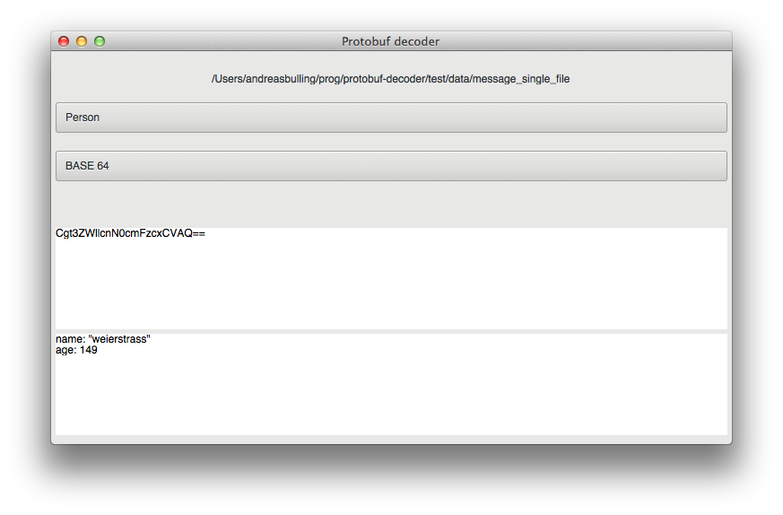

# protobuf-decoder

https://weierstrass.github.io/protobuf-decoder/

## Overview
Are you working with protocol buffer and wants to know what is actually inside the serialized binary data, then you might find this tool handy.



Pre-compiled binaries can be found here https://github.com/weierstrass/protobuf-decoder/releases/latest

## Working with the source code
This project uses the cmake suite to manage building and testing. The testing and mocking util used is [GTest and GMock](https://github.com/google/googletest)

### Build
`$ cmake . && make`

### Running unit tests
`$ cmake . && make && ctest`

### Usage
`$ ./src/protobuf-decoder`

### Problems
Open an issue here on Github.

## Supported conversion algorithms
The supported algorithms to encode the binary data are today:
* hex
* base64

### Need support for another algorithm?
If you know how to implement your algorithm in C++ then you are almost there. The project is open source and designed to make it as easy as possible for a third party to add new algorithms.

Basically this is what you have to do if you want to add a new algorithm:

1. Create a new class in src/conversion/algorithm.
2. Extend the protobuf_decoder::algorithm::BaseAlgorithm class.
3. Register the algorithm using the REGISTER_ALGORITHM macro.
4. Make sure you have added test cases for your algorithm
5. Do a pull request and I would be more than happy to review it.

An example for a new algorithm.
```
// src/conversion/algorithm/MyAlgorithm.hpp
...
class MyAlgorithm : public BaseAlgorithm<MyAlgorithm> // 2. Extend base Algorithm.
{
public:
  virtual ~MyAlgorithm() {}

  virtual std::string encode(const std::string& iString);

  virtual std::string decode(const std::string& iString);
};
  ...
```

```
// src/conversion/algorithm/MyAlgorithm.cpp
...
REGISTER_ALGORITHM(MyAlgorithm, "MY ALGO"); // 3. Register new algorithm.
...
std::string MyAlgorithm::encode(const std::string& iString)
{
  // Encoding implementation.
}

std::string MyAlgorithm::decode(const std::string& iString)
{
  // Decoding implementation.
}
...
```
This is really everything that is needed, if you follow these steps your algorithm should automatically apear in the GUI without any need to modify any existing code. [How does it work?](https://github.com/weierstrass/protobuf-decoder/wiki/Conversion-algorithm-details)

If you do not have the necessary knowledge in C++, you can open an issue here on GitHub and I will try to do it when I find a spare moment.
